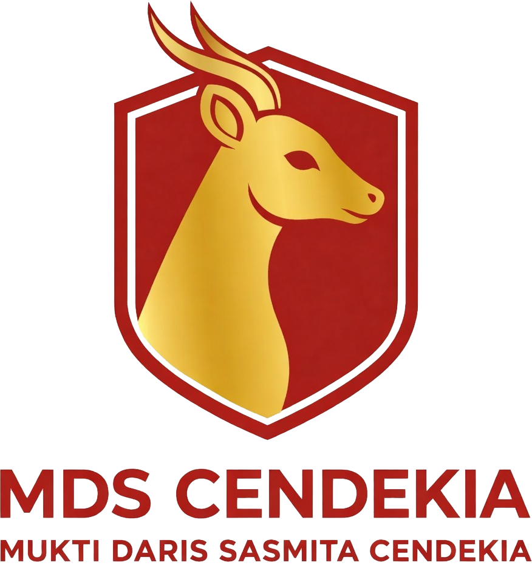

<p align="center">
  
</p>

<h1 align="center">Yayasan Mukti Daris Sasmita Cendekia</h1>

<p align="center">
  Frontend website profil sekolah dan panel administrasi MDS Cendekia berbasis Nuxt.
</p>

## Tentang Project

Repository ini berisi frontend MDS Cendekia dalam bentuk monorepo. Aplikasi dipisahkan menjadi dua bagian agar website publik dan panel admin bisa dikembangkan serta dideploy secara lebih jelas.

- Website publik untuk profil sekolah, informasi PPDB, berita, dan halaman SEO.
- Panel admin untuk pengelolaan data internal sekolah.
- Keduanya menggunakan Nuxt, Vue, TypeScript, dan Tailwind CSS.

## Struktur

```text
apps/web/      Website publik MDS Cendekia
apps/admin/    Panel administrasi MDS Cendekia
```

## Tech Stack

- Nuxt 4
- Vue 3
- TypeScript
- Tailwind CSS
- Nuxt Security
- Nuxt Google Fonts
- Lucide Vue Next

## Setup Lokal

Install dependency:

```bash
npm install
```

Jalankan website publik:

```bash
npm run dev:web
```

Jalankan panel admin:

```bash
npm run dev:admin
```

Secara default:

```text
Web   : http://127.0.0.1:3000
Admin : http://127.0.0.1:3001
```

## Environment

Aplikasi membutuhkan konfigurasi API publik melalui environment variable berikut:

```env
NUXT_PUBLIC_API_BASE_URL=https://your-api-domain.example.com
```

Gunakan file environment sesuai kebutuhan deployment masing-masing environment.

## Script

```bash
npm run dev:web       # menjalankan website publik
npm run dev:admin     # menjalankan panel admin
npm run build:web     # build website publik
npm run build:admin   # build panel admin
npm run lint:web      # lint website publik
npm run lint:admin    # lint panel admin
npm run check:web     # typecheck website publik
npm run check:admin   # typecheck panel admin
```

Root repository juga menyediakan script agregat:

```bash
npm run lint
npm run check
npm run build
```

## Fitur Utama

Website publik:

- Profil sekolah
- Informasi PPDB
- Formulir dan alur pendaftaran
- Berita sekolah
- Sitemap dan robots untuk kebutuhan SEO

Panel admin:

- Login admin
- Dashboard
- Pengelolaan pendaftar
- Pengelolaan siswa
- Pengelolaan berita
- Pengelolaan galeri
- Pengelolaan paket sekolah dan timeline PPDB

## Catatan

- Website publik dan panel admin berada dalam app Nuxt yang berbeda.
- Panel admin dikonfigurasi agar tidak masuk indeks mesin pencari.
- Konfigurasi rahasia seperti token, password, dan private key tidak boleh disimpan di repository.
